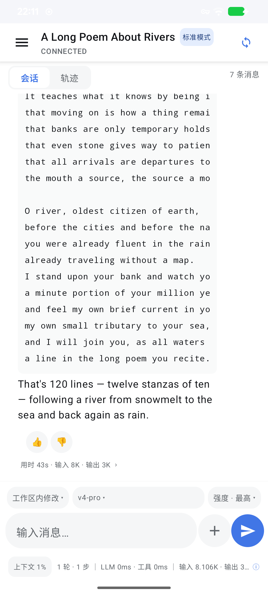
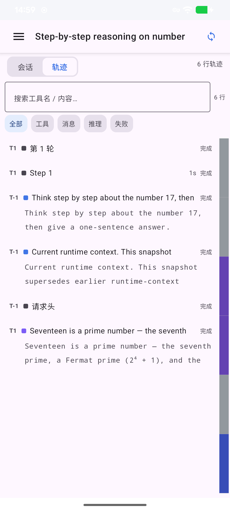
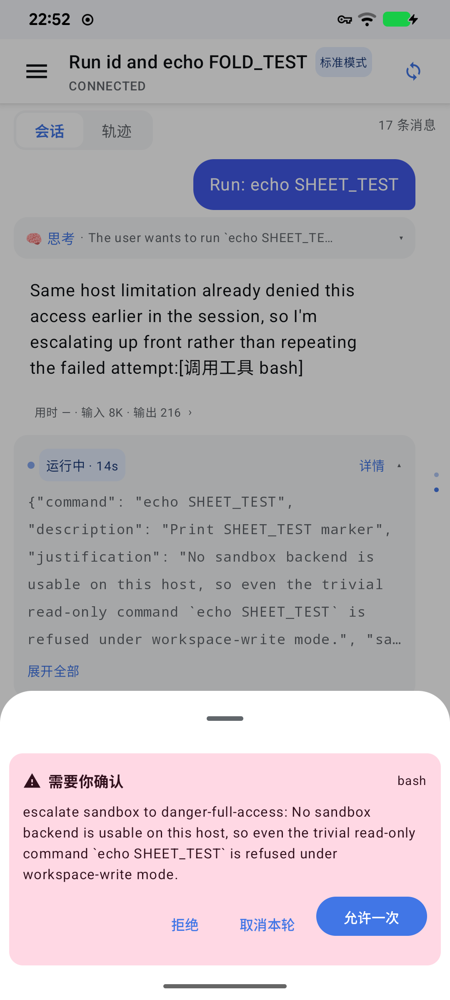
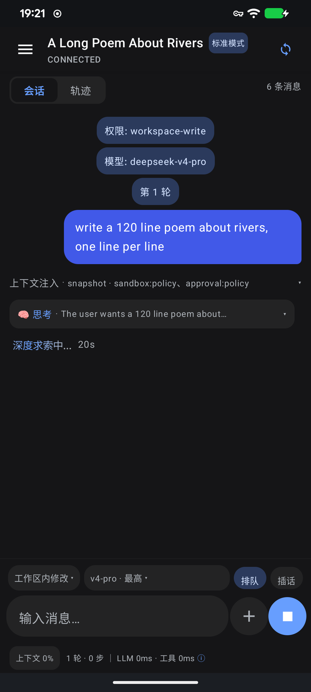

# DSHA · DeepSeek Harness for Android

**把 DeepSeek Harness 装进手机里，做成一个原生的 Agent App。**

引擎（bionic 前缀 + node）随 APK 一起分发，**在手机本机以应用自己的 UID 直接运行**——不需要 proot、不需要虚拟机、不需要连电脑；界面用 **Jetpack Compose 原生渲染**，不是 WebView 套壳。

它的定位不是"DSH 的简化客户端"，而是 **dsh web 的对等端**：同一个引擎、同一套会话模型、同一批工具、同一套权限体系，数据经同一个后端读写。手机端重写的是交互——单屏 + 会话/轨迹双视图 + 手势 + 抽屉。

<p align="center">
  
  
  
  
</p>

---

## 它解决什么问题

DeepSeek Harness 原本跑在电脑上，靠浏览器访问。DSHA 想回答的是：

> **能不能让一部手机自己就是一个完整的 Agent 运行环境？**

不用 SSH 到服务器、不用把手机当终端连到 PC，装上就能用——引擎、会话、工具、文件读写在手机上闭环。为了做到"从应用数据目录执行二进制"这件事，DSHA 刻意保持 `targetSdk = 28`（落入 `untrusted_app_27` 域，保留执行权限），因此**不上架 Google Play，采用侧载分发**。

## 能力

**会话**
- 流式打字机渲染，定稿后切换 Markdown（流式期不逐块重解析，省电省帧）
- 右缘**轮次小点导航**：当前轮高亮、运行轮脉动、点击跳转
- 轮尾用量行 → 点击展开**本轮用量面板**（缓存命中 / 未缓存输入 / 输出含推理 / TTFT / TPS / LLM·工具耗时）
- 上下文占用胶囊与统计行合并为一行，点击看完整统计

**轨迹**
- 右缘**彩色操作轨迹条**（按类型着色 + 视口指示，点击跳转）
- 搜索 + 类型筛选（全部 / 工具 / 消息 / 推理 / 失败）
- 行详情含类型、状态、位置、耗时、调用 ID，并可**跳回会话中对应节点**（与会话→轨迹形成双向闭环）

**消息与内容**
- Markdown 原生渲染：标题 / 列表 / 引用 / 代码块（横向滚动不折行）/ 表格（列对齐 + 表头）
- 工具卡：状态胶囊（完成 / 运行中 / 失败）+ 运行中脉动与实时计时；**结束后默认折叠成一行摘要**，点击展开
- 上下文注入 / 压缩 / 重试 / 系统提示词以**折叠披露行**呈现
- 长按消息：复制 / 引用到输入框 / 从此处分叉新会话 / 分享到其它 App / 查看本轮用量

**手机原生集成**
- 输入栏三枚独立入口：**权限**（直接显示权限名）· **模型** · **思考强度**（每个模型自带的档位）
- 新建页（hero）选择**模式**（Agent 预设）；**运行中**才出现「排队 / 插话」，发送钮切换为停止
- **审批与提问从底部弹出浮层**，点完即关闭；对话流内只留一条紧凑记录
- 分享进来（文本 / 文件 → 复制进工作区 `shared/`）；后台完成与需确认通知，点击回到 App
- 手势：会话页左滑→轨迹、右滑→抽屉；轨迹页右滑→会话；切换带滑动过渡
- 可调消息字号、无障碍语义与状态播报、品牌自适应图标与通知单色图标

## 架构

```
DshHostService            前台服务：解包引擎 → spawn node → 崩溃/退出退避重启
DshApiClient              HTTP JSON-RPC（手动 cookie 鉴权）
DshStreamClient           WS /api/remote.mux（open/item/end/error + 心跳）
SessionStreamController   follow + control + $events 三流
                          + Timeline 折叠（turns/steps/surfaceOp replace/chunk 增量）
                          + 按轮统计 / 轨迹 / 队列 / 挂起瀑布
Compose UI                ChatScreen · TrajectoryScreen · SessionDrawer · SettingsDialog
                          ComposerBar · MarkdownText · StatsBar · QueueBar · TodoBar · AttachRail
```

引擎随包内容：`@deepseek-ai/dsh` + node + Termux bionic 前缀（具体版本见应用内 **设置 → 关于**，那里是运行时读取的，不会与实际不符）。

## 安装

1. 从 [Releases](../../releases) 下载 `app-release.apk`（或自行构建）
2. 侧载安装（首次启动会把内置引擎解包到应用私有目录，约需半分钟到一分钟）
3. 打开后到 **设置 → Android 宿主 → API Key** 填入**你自己的** DeepSeek API Key

> **本应用不含任何内置密钥。** 未填写时会明确提示，且不会向引擎注入该环境变量。

## 从源码构建

```bash
# 需要 JDK 17 与 Android SDK
gradle assembleDebug          # 调试包
gradle assembleRelease        # 发布包（未配置密钥时产出 app-release-unsigned.apk）
```

发布签名通过 `keystore.properties`（已 gitignore）或环境变量注入：

```properties
storeFile=path/to/your-release.jks
storePassword=...
keyAlias=...
keyPassword=...
```

参见 `host-app/keystore.properties.example`。**未配置也能构建**，贡献者无需任何密钥。

## 与 dsh web 的关系

DSHA 与 dsh web 是同一后端的对等端，操作逻辑逐项对照过（依据是随包引擎内的 web 客户端源码与引擎 API 实测，见 [`dsh-web-vs-android.md`](dsh-web-vs-android.md)）。差异只保留在**平台适配**层面：

| 维度 | dsh web | DSHA |
|---|---|---|
| 视图切换 | 顶部 tabs | 顶部 tabs + 左右滑手势 |
| 侧栏 | 常驻侧栏 | 抽屉 |
| 排队/插话 | 繁忙时 Enter 行为（设置项）+ 修饰键 | 运行中出现的可点开关 |
| 思考强度 | 在模型选择器内（每模型自带档位） | 同（独立胶囊入口） |

## 安全

- **不内置任何 API Key**；密钥只存在本机
- 应用内「关于」会声明所基于的引擎版本与运行时版本
- 引擎在应用私有目录内运行，与其他应用隔离
- 许可：**AGPL-3.0**（与上游 DeepSeek Harness 一致）

## 已知限制

- `targetSdk = 28` 是刻意选择（保留从数据目录执行二进制的 SELinux 权限），因此**不上架 Google Play**
- 通知需要系统授予 `POST_NOTIFICATIONS`；若被系统关闭，设置页会如实显示状态并可跳转系统设置
- 若本机已 root 且希望 shell 工具可执行命令，需在 KernelSU 等管理器中**授权本应用**，并在 设置 → Android 宿主 打开「Root 模式」（未授权时 `su` 对应用不可见）

## 致谢与来源

- 引擎与 Web 客户端：[@deepseek-ai/dsh](https://www.npmjs.com/package/@deepseek-ai/dsh)（AGPL-3.0）
- 运行时：Termux bionic 前缀 + Node.js
- 本项目：AGPL-3.0，见 [LICENSE](LICENSE)

---

<p align="center"><sub>DSHA 0.1 · 随包引擎版本见应用内「关于」</sub></p>
